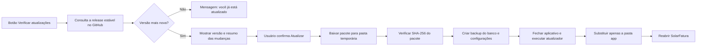

# Distribuição e atualização no Windows

## Decisão de produto

O usuário final **não instalará XAMPP, PHP, MySQL, Composer nem Poppler**. Esses componentes fazem sentido para desenvolvimento, mas criariam suporte desnecessário na operação diária.

O lançamento Windows do SolarFatura será um pacote local, instalado por usuário, que inclui:

- executável iniciador `SolarFatura.exe`;
- runtime PHP e `pdftotext.exe` (Poppler) compatíveis;
- servidor local iniciado automaticamente e aberto em uma janela do navegador;
- banco SQLite e área de arquivos privados;
- atalho no Menu Iniciar e na Área de Trabalho.

O programa continuará funcionando sem internet. Internet será necessária somente para verificar e baixar atualizações.

## Pastas no computador do cliente

```text
%LocalAppData%\SolarFatura\app\        # programa instalado (pode ser substituído em atualização)
%LocalAppData%\SolarFatura\data\       # SQLite, PDFs e configurações do cliente
%LocalAppData%\SolarFatura\backups\    # cópias antes de atualização/restauração
%LocalAppData%\SolarFatura\logs\       # diagnósticos sem dados financeiros sensíveis em texto
```

Separar `app` de `data` é obrigatório: uma atualização nunca deve apagar faturas, banco ou configurações.

## Experiência de instalação

1. O usuário baixa `SolarFatura-Setup.exe` na página **Releases** do GitHub.
2. O instalador explica, em linguagem simples, o que será instalado e solicita a autorização padrão do Windows apenas se for realmente necessária.
3. Os componentes necessários já acompanham o pacote; não haverá telas de PHP, XAMPP, Composer ou comandos.
4. O instalador cria as pastas de dados, testa se o leitor de PDF inicia e abre o SolarFatura.
5. Em caso de erro, apresenta uma mensagem acionável e oferece abrir o arquivo de diagnóstico.

Para evitar UAC em atualizações, o padrão é instalação por usuário em `%LocalAppData%`, e não em `Program Files`.

## Atualização pelo GitHub

Na tela “Configurações”, haverá o botão **Verificar atualizações**:



Regras obrigatórias:

- O aplicativo apenas consulta releases estáveis, nunca branches, commits ou `git pull`.
- O download só é aceito por HTTPS, vindo do repositório oficial configurado no aplicativo.
- Cada release publica um manifesto com versão, URL, SHA-256, tamanho e notas de versão. O hash baixado deve conferir antes de qualquer substituição.
- A atualização faz backup do SQLite antes da migração. Se a nova versão não iniciar, o atualizador oferece restaurar a versão e o banco anteriores.
- Mudanças de banco usam migrations versionadas e reversíveis quando tecnicamente possível.
- Arquivos enviados pelo usuário e banco ficam em `data`; nunca são incluídos no pacote de atualização.
- O usuário confirma a instalação da atualização. Nenhuma atualização silenciosa.

Na primeira versão pública, a verificação pode usar a API de Releases do GitHub. Em seguida, adicionaremos assinatura de código do instalador e do atualizador para reduzir alertas do Windows e fortalecer a cadeia de confiança.

## Processo de publicação

O repositório será público apenas depois da homologação. Cada versão seguirá o formato `v1.2.0` e terá:

- código-fonte e changelog;
- instalador Windows;
- pacote de atualização (`SolarFatura-win.zip`);
- `manifest.json` com SHA-256;
- notas de versão em português;
- verificação automatizada de sintaxe, testes do parser e teste de instalação.

O GitHub Actions criará esses artefatos de maneira reprodutível a partir de uma tag. Segredos, arquivos de teste com CPF real, PDFs de clientes e bancos de dados nunca entram no repositório.

## Próximas implementações

1. Migrar a persistência para SQLite e criar backup/restauração dentro da aplicação.
2. Criar o iniciador Windows e empacotar PHP + Poppler.
3. Criar instalador por usuário e teste de instalação limpa em uma máquina Windows sem ambiente de desenvolvimento.
4. Criar o atualizador com manifesto, hash e rollback.
5. Só então criar o repositório público, configurar GitHub Actions e publicar a primeira release.
